# Hand gesture recognition using neural networks

## Developers

Santhosh Kumar [https://www.linkedin.com/in/santhoshkumar/]

Sanyog Yadav [https://www.linkedin.com/in/sanyog-yadav-cfa]

## Problem Statement

Imagine you are working as a data scientist at a home electronics company which manufactures state of the art smart televisions. You want to develop a cool feature in the smart-TV that can recognise five different gestures performed by the user which will help users control the TV without using a remote.

The gestures are continuously monitored by the webcam mounted on the TV. Each gesture corresponds to a specific command:

- Thumbs up:  Increase the volume
- Thumbs down: Decrease the volume
- Left swipe: 'Jump' backwards 10 seconds
- Right swipe: 'Jump' forward 10 seconds  
- Stop: Pause the movie

Each video is a sequence of 30 frames (or images)

## Understanding the Dataset

The training data consists of a few hundred videos categorised into one of the five classes. Each video (typically 2-3 seconds long) is divided into a sequence of 30 frames(images). These videos have been recorded by various people performing one of the five gestures in front of a webcam - similar to what the smart TV will use.

The data is in a [zip](https://www.dropbox.com/s/72jzl3fqvk1rk2w/gesture_data.zip?dl=0) file. The zip file contains a 'train' and a 'val' folder with two CSV files for the two folders.


These folders are in turn divided into subfolders where each subfolder represents a video of a particular gesture.

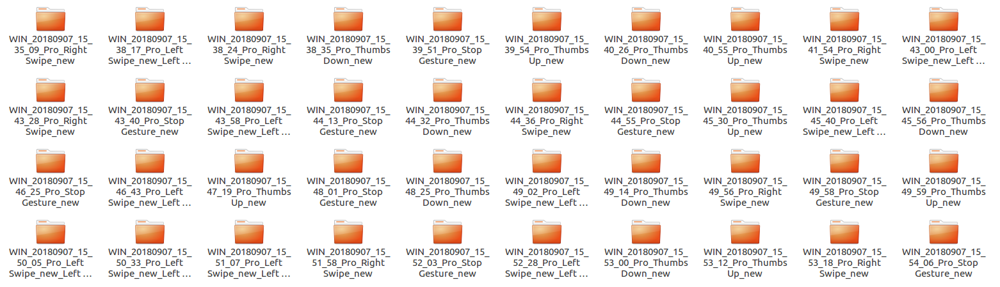

Each subfolder, i.e. a video, contains 30 frames (or images). 

- Thumbs Up
  
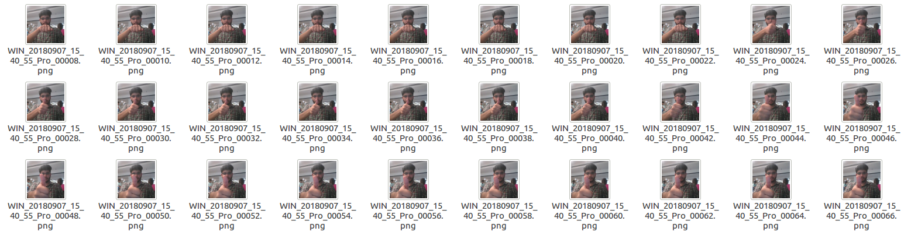

- Right Swipe

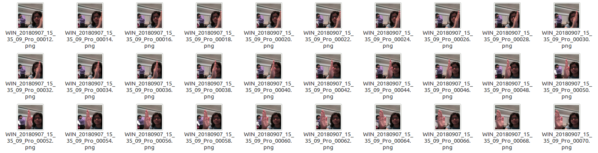

Note that all images in a particular video subfolder have the same dimensions but different videos may have different dimensions. Specifically, videos have two types of dimensions - either 360x360 or 120x160 (depending on the webcam used to record the videos).

## Two Architectures: 3D Convs and CNN-RNN Stack

After understanding and acquiring the dataset, the next step is to try out different architectures to solve this problem. 

For analysing videos using neural networks, two types of architectures are used commonly. 

One is the standard **CNN + RNN** architecture in which you pass the images of a video through a CNN which extracts a feature vector for each image, and then pass the sequence of these feature vectors through an RNN. 

*Note:*
 - You can use transfer learning in the 2D CNN layer rather than training your own CNN 
 - GRU (Gated Recurrent Unit) or LSTM (Long Short Term Memory) can be used for the RNN

The other popular architecture used to process videos is a natural extension of CNNs - a **3D convolutional network**. In this project, we will try both these architectures.

## Data Preprocessing

We can apply several of the image procesing techniques for each of image in the frame.

### Resize

 We will convert each image of the train and test set into a matrix of size 120*120

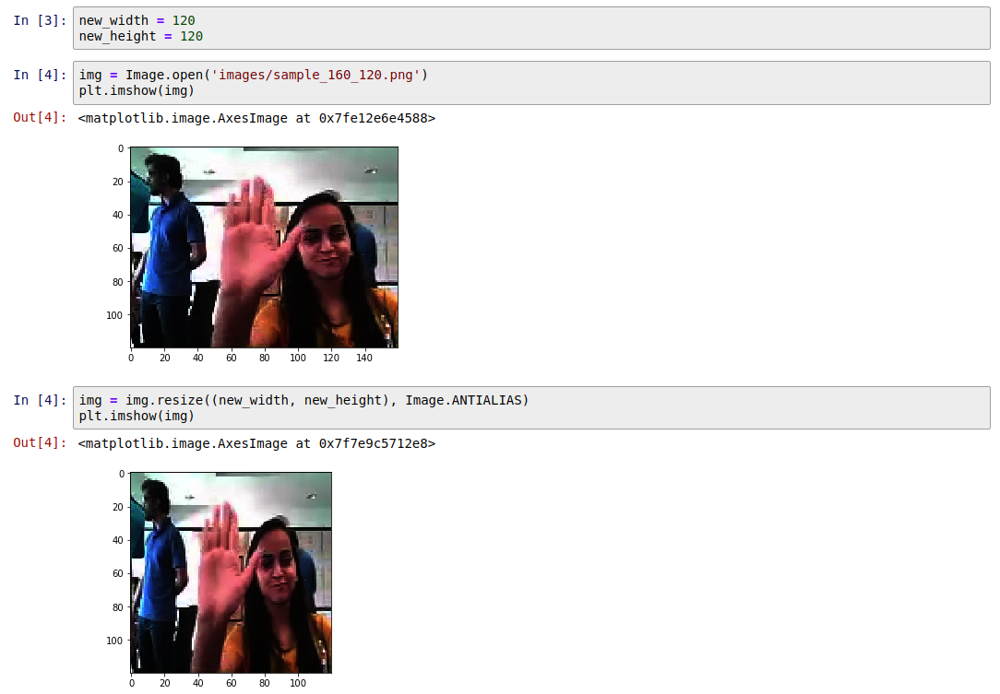

### Cropping

Given that one of the data set is of rectangualr shape, we will crop that image to 120*120, this is different to resize, while resize changes the aspect ratio of rectangular image. In cropping we will center crop the image to retain the middle of the frame.

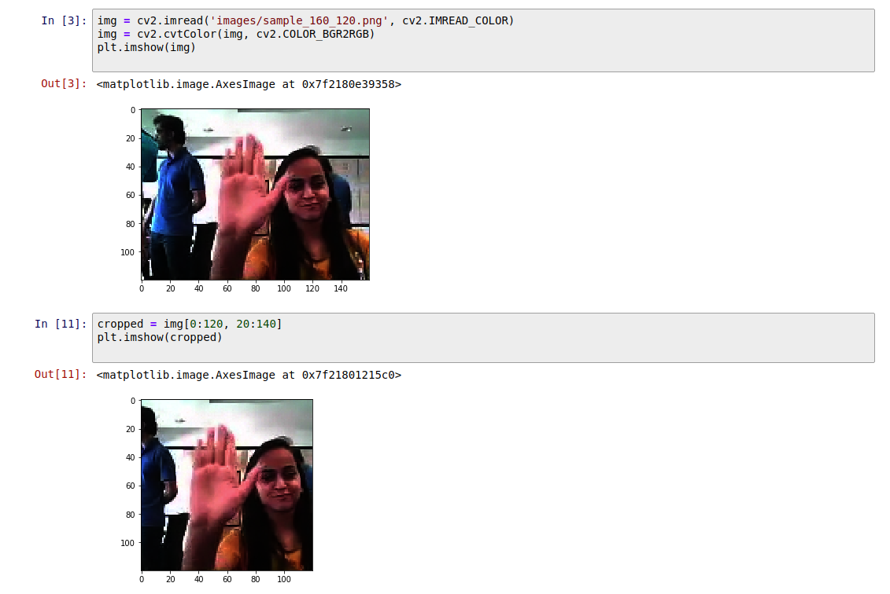

### Edge Detection
We will also experiemnt with edge detection for image processing

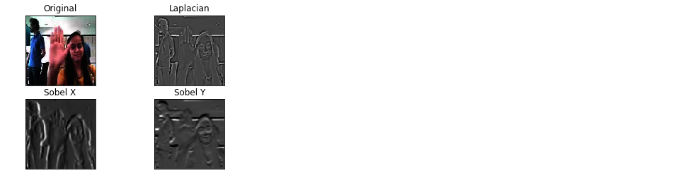

#### Sobel Edge Detection
Sobel edge detector is a gradient based method based on the first order derivatives. It calculates the first derivatives of the image separately for the X and Y axes.

https://en.wikipedia.org/wiki/Sobel_operator

#### Laplacian Edge Detection
Unlike the Sobel edge detector, the Laplacian edge detector uses only one kernel. It calculates second order derivatives in a single pass.

We will perform edge detection on each channel and use the comibined 3 channel as input 

Edge detection Red channel


Edge detection Green channel
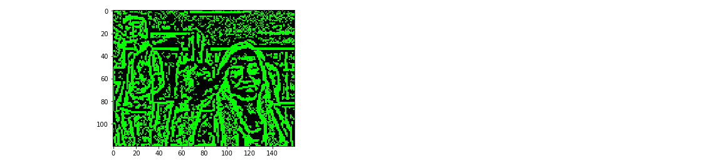

Edge detection Blue channel
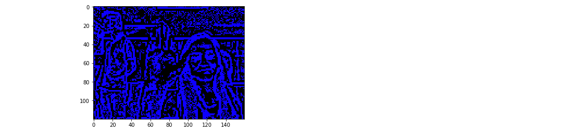

Edge detection 
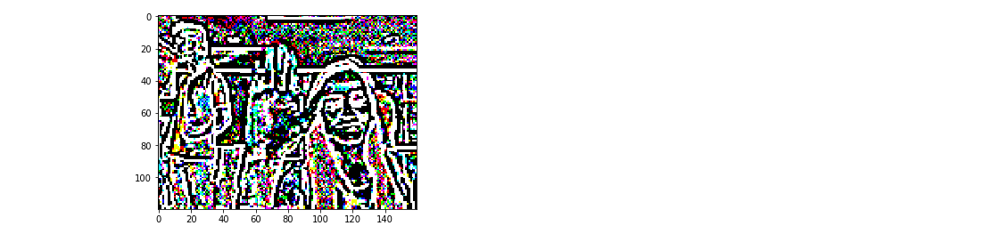

### Normalization

We will use mean normaliztion for each of the channel in the image.

## Data Agumentation

We have a total of 600+ for test set and 100 sampels for validation set. We will increase this 2 fold by usign a simple agumentiaton technique of affine transforamtion.

### Affine Transformation

In affine transformation, all parallel lines in the original image will still be parallel in the output image. To find the transformation matrix, we need three points from input image and their corresponding locations in output image. Then cv2.getAffineTransform will create a 2x3 matrix which is to be passed to cv2.warpAffine.

Check below example, and also look at the points I selected (which are marked in Green color):

``` python
img = cv2.imread('drawing.png')
rows,cols,ch = img.shape

pts1 = np.float32([[50,50],[200,50],[50,200]])
pts2 = np.float32([[10,100],[200,50],[100,250]])

M = cv2.getAffineTransform(pts1,pts2)

dst = cv2.warpAffine(img,M,(cols,rows))

plt.subplot(121),plt.imshow(img),plt.title('Input')
plt.subplot(122),plt.imshow(dst),plt.title('Output')
plt.show()
```

See the result:

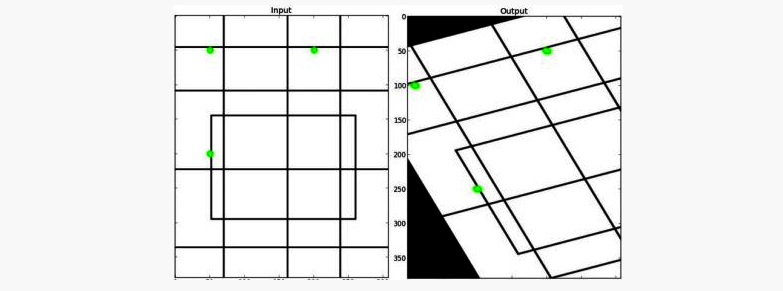


We will perform a same random affine transform for all the images in the frameset. This way we are generating new dataset from existing dataset.

### Flipping Images Horizontally

Note that fliiping images horizontally comes with special cavet, we need to swap the left swipe <-> right swipe as we flip the image.
This technique of image augmentation adds more generalization to the dataset.

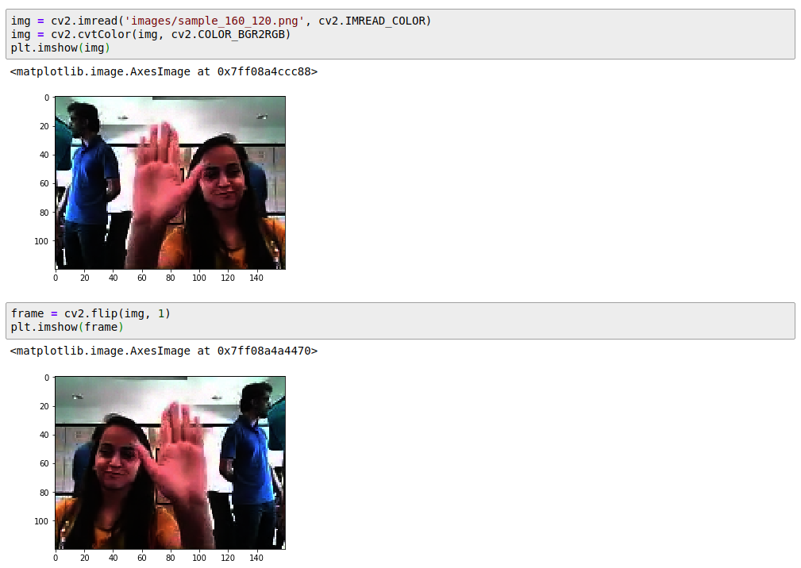

## Generators

**Understanding Generators**: As you already know, in most deep learning projects you need to feed data to the model in batches. This is done using the concept of generators. 

Creating data generators is probably the most important part of building a training pipeline. Although libraries such as Keras provide builtin generator functionalities, they are often restricted in scope and you have to write your own generators from scratch. In this project we will implement our own cutom generator, our generator will feed batches of videos, not images. 

Let's take an example, assume we have 23 samples and we pick batch size as 10.

In this case there will be 2 complete batches of ten each
- Batch 1: 10
- Batch 2: 10
- Batch 3: 3

The final run will be for the remaining batch that was not part of the the full batch. 

Full batches are covered as part of the for loop the remainder are covered post the for loop.

Note: this also covers the case, where in batch size is day 30 and we have only 23 samples. In this case there will be only one single batch with 23 samples.

## Reading Video as Frames

Note that in our project, each gesture is a broken into indivdual frame. Each gesture consists of 30 individual frames. While loading this data via the generator there is need to sort the frames if we want to maintain the temporal information.

The order of the images loaded might be random and so it is necessary to apply sort on the list of files before reading each frame.


# Implementation 

## 3D Convolutional Network, or Conv3D

Now, lets implement a 3D convolutional Neural network on this dataset. To use 2D convolutions, we first convert every image into a 3D shape : width, height, channels. Channels represents the slices of Red, Green, and Blue layers. So it is set as 3. In the similar manner, we will convert the input dataset into 4D shape in order to use 3D convolution for : length, breadth, height, channel (r/g/b).

*Note:* even though the input images are rgb (3 channel), we will perform image processing on each frame and the end individual frame will be grayscale (1 channel) for some models

Lets create the model architecture. The architecture is described below:

While we tried with multiple ***filter size***, bigger filter size is resource intensive and we have done most experiment with 3*3 filter

We have used **Adam** optimizer with its default settings.
We have additionally used the ReduceLROnPlateau to reduce our learning alpha after 2 epoch on the result plateauing.


## Model #1

Build a 3D convolutional network, based loosely on C3D.

https://arxiv.org/pdf/1412.0767.pdf

```python

        model = Sequential()
        model.add(Conv3D( 8, (3,3,3), activation='relu', input_shape=input_shape ))
        model.add(MaxPooling3D(pool_size=(1, 2, 2), strides=(1, 2, 2)))
        model.add(Conv3D(16, (3,3,3), activation='relu'))
        model.add(MaxPooling3D(pool_size=(1, 2, 2), strides=(1, 2, 2)))
        model.add(Conv3D(32, (3,3,3), activation='relu'))
        model.add(Conv3D(32, (3,3,3), activation='relu'))
        model.add(MaxPooling3D(pool_size=(1, 2, 2), strides=(1, 2, 2)))
        model.add(Conv3D(64, (2,2,2), activation='relu'))
        model.add(Conv3D(64, (2,2,2), activation='relu'))
        model.add(MaxPooling3D(pool_size=(1, 2, 2), strides=(1, 2, 2)))

        model.add(Flatten())
        model.add(Dense(512))
        model.add(Dropout(0.5))
        model.add(Dense(256))
        model.add(Dropout(0.5))
        model.add(Dense(nb_classes, activation='softmax'))
```
Model Summary

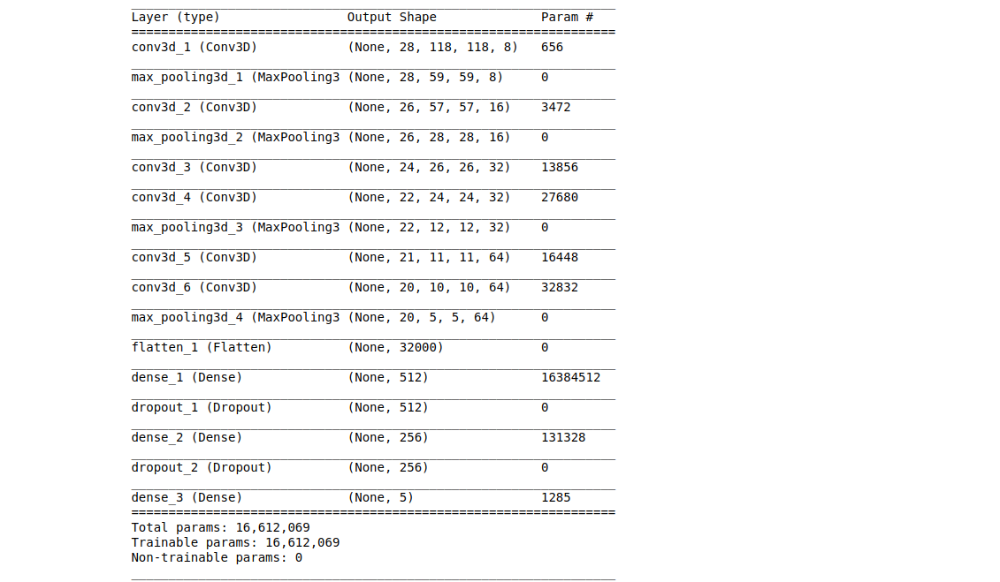

## Model #2

Build a 3D convolutional network, aka C3D.

https://arxiv.org/pdf/1412.0767.pdf
```python
        model = Sequential()
        # 1st layer group
        model.add(Conv3D(16, 3, 3, 3, activation='relu',
                         padding='same', name='conv1',
                         subsample=(1, 1, 1),
                         input_shape=input_shape))
        model.add(MaxPooling3D(pool_size=(1, 2, 2), strides=(1, 2, 2),
                               border_mode='valid', name='pool1'))
        # 2nd layer group
        model.add(Conv3D(32, 3, 3, 3, activation='relu',
                         padding='same', name='conv2',
                         subsample=(1, 1, 1)))
        model.add(MaxPooling3D(pool_size=(2, 2, 2), strides=(2, 2, 2),
                               border_mode='valid', name='pool2'))
        # 3rd layer group
        model.add(Conv3D(64, 3, 3, 3, activation='relu',
                         padding='same', name='conv3a',
                         subsample=(1, 1, 1)))
        model.add(Conv3D(64, 3, 3, 3, activation='relu',
                         padding='same', name='conv3b',
                         subsample=(1, 1, 1)))
        model.add(MaxPooling3D(pool_size=(2, 2, 2), strides=(2, 2, 2),
                               border_mode='valid', name='pool3'))
        # 4th layer group
        model.add(Conv3D(128, 3, 3, 3, activation='relu',
                         padding='same', name='conv4a',
                         subsample=(1, 1, 1)))
        model.add(Conv3D(128, 3, 3, 3, activation='relu',
                         padding='same', name='conv4b',
                         subsample=(1, 1, 1)))
        model.add(MaxPooling3D(pool_size=(2, 2, 2), strides=(2, 2, 2),
                               border_mode='valid', name='pool4'))

        # 5th layer group
        model.add(Conv3D(256, 3, 3, 3, activation='relu',
                         padding='same', name='conv5a',
                         subsample=(1, 1, 1)))
        model.add(Conv3D(256, 3, 3, 3, activation='relu',
                         padding='same', name='conv5b',
                         subsample=(1, 1, 1)))
        model.add(ZeroPadding3D(padding=(0, 1, 1)))
        model.add(MaxPooling3D(pool_size=(2, 2, 2), strides=(2, 2, 2),
                               padding='valid', name='pool5'))
        model.add(Flatten())

        # FC layers group
        model.add(Dense(512, activation='relu', name='fc6'))
        model.add(Dropout(0.5))
        model.add(Dense(512, activation='relu', name='fc7'))
        model.add(Dropout(0.5))
        model.add(Dense(nb_classes, activation='softmax'))
```
Model Summary

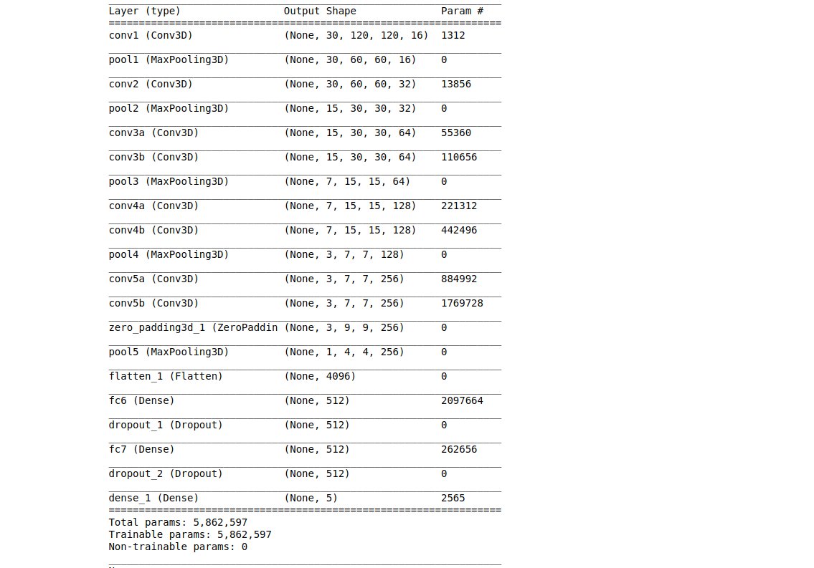

## Model #3

Custom model
``` python
        model = Sequential()
        model.add(Conv3D(16, kernel_size=(3, 3, 3), input_shape=input_shape, padding='same'))
        model.add(Activation('relu'))
        model.add(Conv3D(16, padding="same", kernel_size=(3, 3, 3)))
        model.add(Activation('relu'))
        model.add(MaxPooling3D(pool_size=(3, 3, 3), padding="same"))
        model.add(Dropout(0.25))

        model.add(Conv3D(32, padding="same", kernel_size=(3, 3, 3)))
        model.add(Activation('relu'))
        model.add(Conv3D(32, padding="same", kernel_size=(3, 3, 3)))
        model.add(Activation('relu'))
        model.add(MaxPooling3D(pool_size=(3, 3, 3), padding="same"))
        model.add(Dropout(0.25))

        model.add(Conv3D(32, padding="same", kernel_size=(3, 3, 3)))
        model.add(Activation('relu'))
        model.add(Conv3D(32, padding="same", kernel_size=(3, 3, 3)))
        model.add(Activation('relu'))
        model.add(MaxPooling3D(pool_size=(3, 3, 3), padding="same"))
        model.add(Dropout(0.25))

        model.add(Flatten())
        model.add(Dense(512, activation='relu'))
        model.add(BatchNormalization())
        model.add(Dropout(0.5))
        model.add(Dense(nb_classes, activation='softmax'))
```

Model Summary

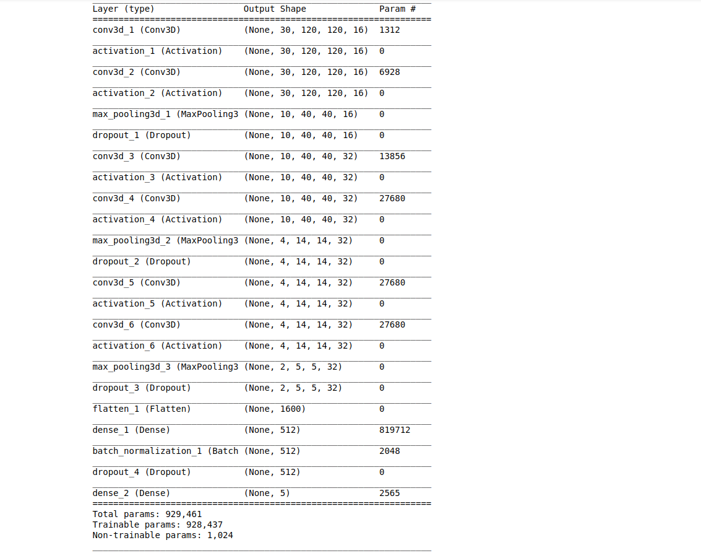

## Model #4
```python
        model = Sequential()

        model.add(Conv3D(8, kernel_size=(3,3,3), input_shape=input_shape, padding='same'))
        model.add(BatchNormalization())
        model.add(Activation('relu'))

        model.add(MaxPooling3D(pool_size=(2,2,2)))

        model.add(Conv3D(16, kernel_size=(3,3,3), padding='same'))
        model.add(BatchNormalization())
        model.add(Activation('relu'))

        model.add(MaxPooling3D(pool_size=(2,2,2)))

        model.add(Conv3D(32, kernel_size=(1,3,3), padding='same'))
        model.add(BatchNormalization())
        model.add(Activation('relu'))

        model.add(MaxPooling3D(pool_size=(2,2,2)))

        model.add(Conv3D(64, kernel_size=(1,3,3), padding='same'))
        model.add(Activation('relu'))
        model.add(Dropout(0.25))

        model.add(MaxPooling3D(pool_size=(2,2,2)))

        #Flatten Layers
        model.add(Flatten())

        model.add(Dense(256, activation='relu'))
        model.add(Dropout(0.5))

        model.add(Dense(128, activation='relu'))
        model.add(Dropout(0.5))

        #softmax layer
        model.add(Dense(5, activation='softmax'))
```

Model Summary

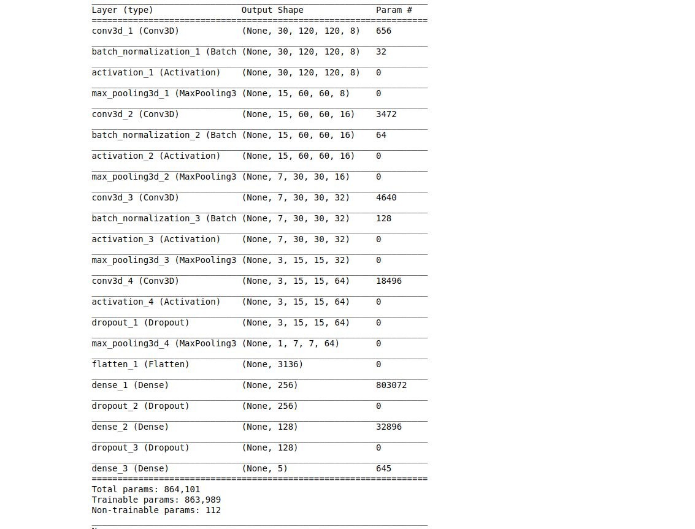

## Model #5

Input and Output layers:

- One Input layer with dimentions 30, 120, 120, 3
- Output layer with dimentions 5

Convolutions :

- Apply 4 Convolutional layer with increasing order of filter size (standard size : 8, 16, 32, 64) and fixed kernel size = (3, 3, 3)
- Apply 2 Max Pooling layers, one after 2nd convolutional layer and one after fourth convolutional layer.

MLP (Multi Layer Perceptron) architecture:

- Batch normalization on convolutiona architecture
- Dense layers with 2 layers followed by dropout to avoid overfitting

```python
        model = Sequential()

        model.add(Conv3D(8, kernel_size=(3,3,3), input_shape=input_shape, padding='same'))
        model.add(BatchNormalization())
        model.add(Activation('relu'))
        model.add(Dropout(0.25))

        model.add(MaxPooling3D(pool_size=(2,2,2)))

        model.add(Conv3D(16, kernel_size=(3,3,3), padding='same'))
        model.add(BatchNormalization())
        model.add(Activation('relu'))
        model.add(Dropout(0.25))

        model.add(MaxPooling3D(pool_size=(2,2,2)))

        model.add(Conv3D(32, kernel_size=(1,3,3), padding='same'))
        model.add(BatchNormalization())
        model.add(Activation('relu'))
        model.add(Dropout(0.25))

        model.add(MaxPooling3D(pool_size=(2,2,2)))

        model.add(Conv3D(64, kernel_size=(1,3,3), padding='same'))
        model.add(Activation('relu'))
        model.add(Dropout(0.25))

        model.add(MaxPooling3D(pool_size=(2,2,2)))

        #Flatten Layers
        model.add(Flatten())

        model.add(Dense(256, activation='relu'))
        model.add(Dropout(0.5))

        model.add(Dense(128, activation='relu'))
        model.add(Dropout(0.5))

        #softmax layer
        model.add(Dense(5, activation='softmax'))
```

Model Summary


Model 5 gave us **test accuracy of 87% and validation accuracy of 87%** using all the 30 frames. The same model is submitted for the review. 
While we did try model lesser frames by using even frames but we felt more comfortable using full frame. Cropping and other preprocessing also did not affect much on the final accuracy.

Link to modle ->  https://drive.google.com/open?id=12wMsLnLGYWCK9B9AKIfoGjxx5pZkRr3h
